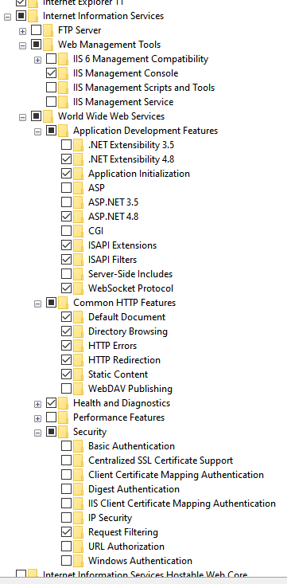
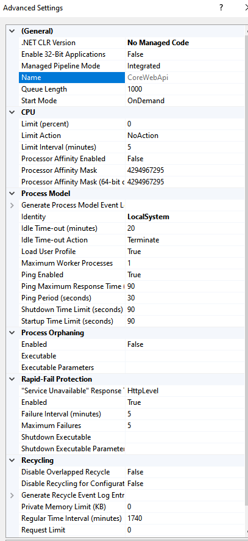

## Deploy to IIS
Make sure you have IIS installed from windows features

Create one app pool for each .Net Core application

Use IIS Express instead of localdb, in connection strings
PCNAME\\SQLEXPRESS

### create iis application, with publish folder configured
### create iis pool (no managed code)
The user running the pool should be NetworkService
### publish application
>In Package Manager Console, select default project context

#### Web Site
>dotnet publish -c Release

>copy folder ...\CoreLoanManagement\CoreLoanManagement.WebSite\bin\Release\net8.0\publish

>to folder 	C:\inetpub\wwwroot\CoreLoanManagement.WebSite

>add to web.config, inside tag <aspNetCore...
	<environmentVariables>
		<environmentVariable name="ASPNETCORE_ENVIRONMENT" value="Development" />
	</environmentVariables>

Start web site:
http://localhost/CoreLoanManagement.WebSite/

#### Web Api
>dotnet publish -c Release

>copy folder ...\CoreLoanManagement\CoreLoanManagement.WebApi\bin\Release\net8.0\publish

>to folder 	C:\inetpub\wwwroot\CoreLoanManagement.WebApi

>add to web.config, inside tag <aspNetCore...
	<environmentVariables>
		<environmentVariable name="ASPNETCORE_ENVIRONMENT" value="Development" />
	</environmentVariables>

Start web api
http://localhost/CoreLoanManagement.WebApi/swagger/index.html

## Further reading

https://learn.microsoft.com/en-us/aspnet/core/tutorials/publish-to-iis?view=aspnetcore-8.0&tabs=visual-studio#install-the-net-core-hosting-bundle

https://stackoverflow.com/questions/73103156/how-to-keep-asp-net-core-app-avoid-periodic-shutting-down-in-iis

https://stackoverflow.com/questions/38529123/asp-net-core-404-error-on-iis-10
dotnet publish -c Release -r win-x64 --self-contained

https://stackify.com/how-to-deploy-asp-net-core-to-iis/

https://dotnet.microsoft.com/en-us/download/dotnet/thank-you/runtime-aspnetcore-8.0.1-windows-hosting-bundle-installer

	System.InvalidOperationException: Application is running inside IIS process but is not configured to use IIS server.
	https://learn.microsoft.com/en-us/aspnet/core/test/troubleshoot-azure-iis?view=aspnetcore-8.0

	https://stackoverflow.com/questions/58080353/application-is-running-inside-iis-process-but-is-not-configured-to-use-iis-serve